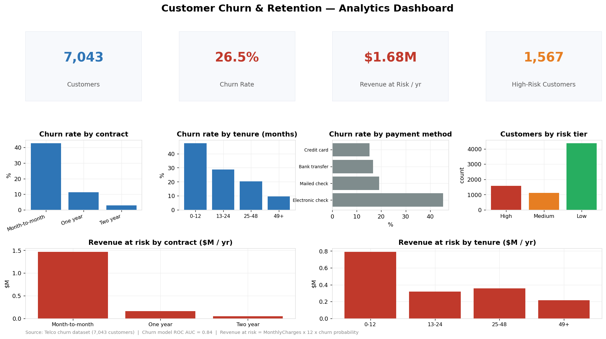

# Customer Retention Intelligence System

A machine learning–driven customer churn prediction and retention analytics platform designed to help subscription businesses identify at-risk customers and take proactive action.

## 🚀 Overview
This project builds a complete end-to-end churn intelligence system using real telecom customer data. It combines exploratory data analysis, statistical insights, and machine learning to predict customer churn and quantify revenue at risk.

## 📊 Dataset
IBM Telco Customer Churn Dataset (7,000+ customers)

Features include:
- Tenure
- Monthly & Total Charges
- Contract Type
- Internet Service
- Payment Method
- Customer Demographics

Target:
- Churn (Yes / No)

## 🔍 Key Insights
- Month-to-month customers churn 15× more than two-year contract users
- Fiber optic users show the highest churn
- High-paying customers are more likely to leave

## 🤖 Machine Learning
Model: Logistic Regression  
Metrics:
- ROC AUC ≈ 0.80+

The model predicts churn probability for each customer and identifies the strongest churn drivers.

## 🧠 Churn Intelligence Engine
The system generates:
- Individual churn risk scores
- High-risk customer lists
- Revenue at risk estimates

This enables targeted retention strategies such as discounts, service improvements, and contract upgrades.


## 📁 Project Structure
```
Customer-Retention-Intelligence-System/
├── data/
├── notebooks/
├── models/
├── reports/
└── README.md
```
## 📊 Power BI Dashboard
An interactive **Power BI** dashboard turns the churn model's output into a
commercial-analytics deliverable — segmenting customers by risk and quantifying
the **revenue at risk** so retention effort can be prioritized.



| Metric | Value |
|---|---|
| Customers analysed | 7,043 |
| Overall churn rate | 26.5% |
| **Annual revenue at risk** | **~$1.68M** |
| High-risk customers flagged | 1,567 |
| Churn model (ROC AUC) | **0.84** |

**Pipeline:** `scripts/build_dashboard.py` cleans the data, trains the churn
model, scores every customer, and derives a **risk tier** (High/Medium/Low) and
**revenue at risk** (`MonthlyCharges × 12 × churn_probability`), writing a
Power BI–ready table to `data/churn_scored.csv`.

**Build it:** the interactive dashboard is assembled in Power BI Desktop (free)
from `data/churn_scored.csv` — step-by-step guide in
[`powerbi/BUILD_GUIDE.md`](powerbi/BUILD_GUIDE.md) and all DAX measures in
[`powerbi/DAX_measures.md`](powerbi/DAX_measures.md).

```bash
pip install -r requirements.txt
python scripts/build_dashboard.py   # regenerates the scored data + dashboard preview
```

## 🛠 Tech Stack
- Python
- Pandas, NumPy
- Scikit-learn
- Matplotlib
- **Power BI** (interactive dashboard) + **DAX**

## 📌 Use Case
Designed for subscription-based businesses such as telecom, SaaS, streaming, and e-commerce platforms to improve customer retention and reduce revenue loss.
